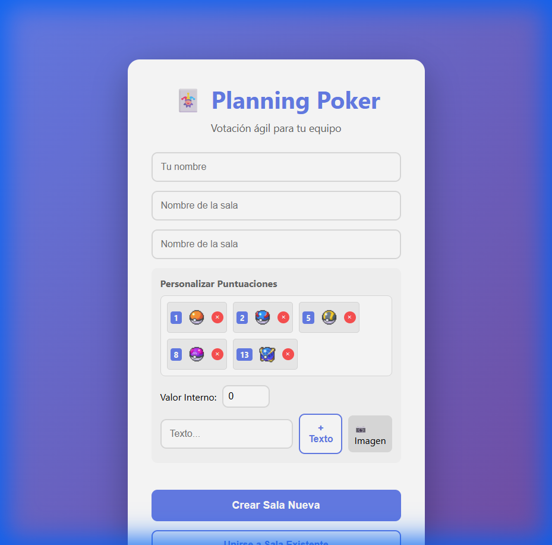
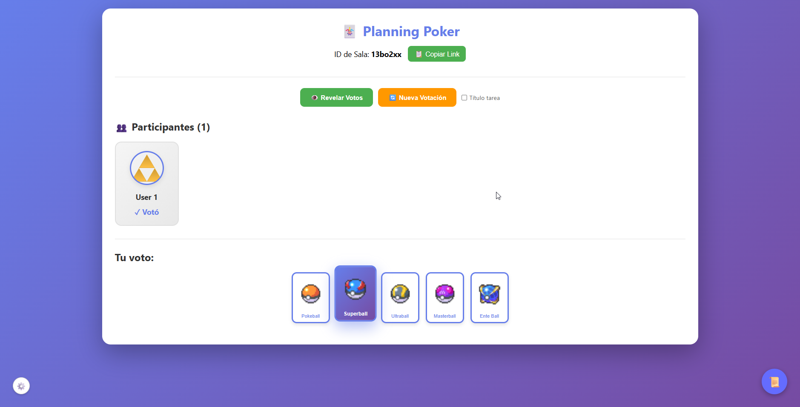
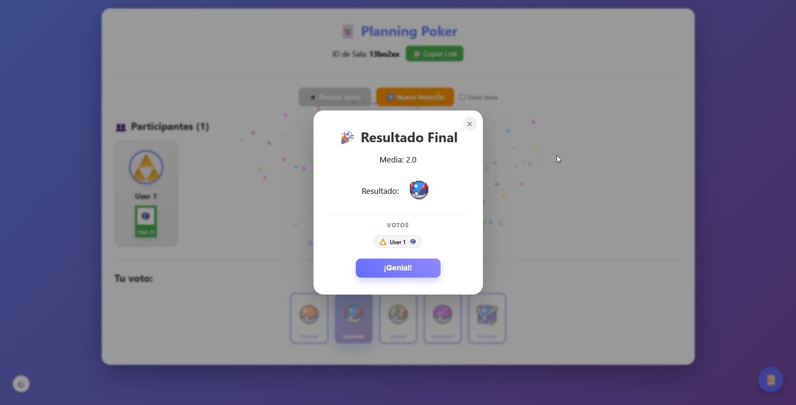
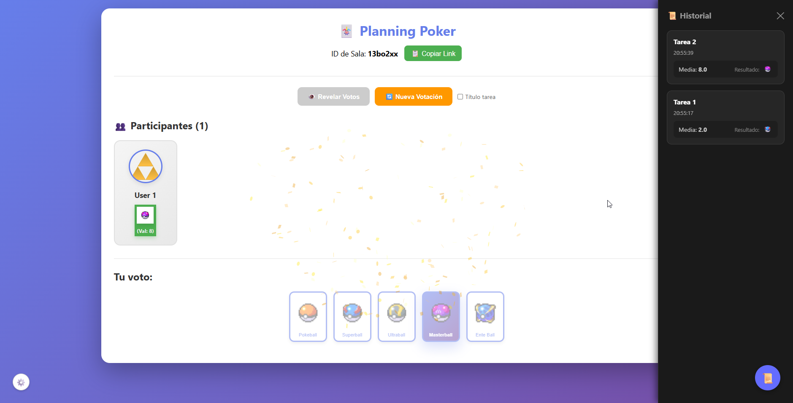

# 🃏 Planning Poker - Edición Pokeball

Aplicación de Planning Poker vitaminada para equipos ágiles. Ahora con soporte para **imágenes**, **puntuaciones con peso ("weighted scores")** y persistencia de configuración.

✨ **Nueva Funcionalidad Estrella**: Sistema de votación tipo "Pokeball". Sube imágenes (Pokeballs), asígnales un valor interno (ej: Masterball = 100) y deja que el sistema calcule la media y te diga qué Pokeball deberías usar.

## 🚀 Características

- **🃏 Votación Visual**: Sube imágenes para usar como cartas de votación.
- **⚖️ Puntuaciones con Peso**: Asigna valores numéricos a tus cartas (sean texto o imágenes) para calcular medias precisas.
- **💾 Persistencia**: Tu configuración de puntuaciones se guarda automáticamente en tu navegador.
- **🔄 Tiempo Real**: Verás quién entra, quién vota y los resultados al instante (WebSockets).
- **📜 Historial de Votación**: Historial accesible en barra lateral (toggle) que registra cada ronda.
- **⚙️ Configuración Global**: Cambia tu avatar en cualquier momento desde el menú de ajustes.
- **🎉 Resultados Visuales**: Popup de resultados con confeti y detalle de votos con scroll inteligente.
- **🛡️ Seguridad Mejorada**: Protección contra spam de subidas (Rate limiting).
- **📱 Responsive**: Funciona perfecto en móvil y escritorio.
- **🔗 Compartible**: Copia el link de la sala y pásalo a tu equipo.


*Pantalla de configuración con las nuevas Pokeballs*


*Sala de votación mostrando cartas y participantes*


*Sala de votación mostrando cuando finaliza una votación*


*Sala de votación mostrando el historial de votaciones*

---

## 🛠️ Guía de Instalación y Puesta en Marcha

Sigue estos pasos para arrancar el proyecto en tu máquina local.

### Prerrequisitos
- Tener instalado **Node.js** (versión 16 o superior recomendada).
- Terminal (PowerShell, CMD, Bash, etc.).

### 1. Clonar/Descargar
Si tienes el código en un zip, descomprímelo. Si usas git:
```bash
git clone <url-del-repo>
cd planning-poker-app
```

### 2. Configurar el Backend (Servidor)
El backend maneja las salas, los sockets y la subida de imágenes.

```bash
cd backend
npm install
# Crea la carpeta para las subidas si no existe (opcional, el código lo hace, pero por seguridad)
mkdir uploads 
npm run dev
```
> El servidor arrancará en `http://localhost:3001`

### 3. Configurar el Frontend (Interfaz)
Abre **otra terminal** (no cierres la del backend) y ve a la carpeta frontend.

```bash
cd frontend
npm install
npm run dev
```
> La web arrancará normalmente en `http://localhost:5173`

---

## 📖 Guía de Uso

### 1. Crear una Sala y Configurar Puntuaciones
1. Abre `http://localhost:5173`.
2. Verás el panel de **"Personalizar Puntuaciones"**.
   - Por defecto ya vienen configuradas las **Pokeballs** (Pokeball=1, Great=2, Ultra=5, Master=8, Enteball=13).
   - **Para añadir tus propias cartas**:
     1. Escribe el **Valor Interno** (el número que se usará para la media).
     2. Escribe un texto y pulsa "+ Texto" O pulsa "📷 Imagen" para subir una foto.
     3. ¡Listo! Se añadirá a tu baraja.
3. Pon tu nombre y el nombre de la sala.
4. Pulsa **"Crear Sala Nueva"**.

### 2. Invitar al Equipo
1. Dentro de la sala, verás un botón **"📋 Copiar Link"** arriba a la derecha.
2. Mándaselo a tus compañeros.
3. Ellos solo tendrán que poner su nombre y entrarán directos.

### 3. Votación
1. Selecciona la carta (Pokeball) que represente la complejidad de la tarea.
2. Tu voto quedará oculto ("✓ Votó") hasta que se revelen.
3. El administrador (o cualquiera en la sala) pulsa **"👁️ Revelar Votos"**.

### 4. Resultados
1. Se mostrarán todas las cartas elegidas.
2. El sistema calculará la **Media** de los valores internos (ej: Media 6.3).
3. Automáticamente buscará la carta que cubra esa media (redondeando hacia arriba) y te la mostrará como **Resultado Sugerido** (ej: Masterball [Valor 8]).

### 5. Nueva Ronda
1. Pulsa **"🔄 Nueva Votación"**.
2. Opcionalmente, escribe el nombre de la siguiente historia/tarea.
3. Los votos se limpian y se ocultan de nuevo.

---

## 🏗️ Estructura del Proyecto

- **`/backend`**: Servidor Node.js + Express + Socket.io.
  - `server.js`: Lógica principal.
  - `/uploads`: Carpeta donde se guardan las imágenes subidas.
- **`/frontend`**: React + Vite + TypeScript.
  - `App.tsx`: Lógica de la interfaz y componentes.
  - `App.css`: Estilos.

## 🐛 Solución de Problemas Comunes

- **Error al subir imagen**: Asegúrate de que la carpeta `backend/uploads` existe y tiene permisos de escritura.
- **No cargan las imágenes**: Asegúrate de que el backend (`localhost:3001`) está corriendo. Las imágenes se sirven desde ahí.
- **"Connection Error"**: Verifica que tanto frontend como backend están ejecutándose en sus respectivas terminales.

---

Desarrollado para hacer tus plannings más divertidos. ¡Hazte con todos (los puntos)! 🔴⚪
